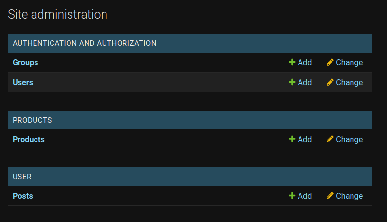

# Traxeda Assignment
*Traxeda intership shortlisting process*<br>
**Django Application (Python 3.8)**

### How to run
```
- clone the repo
- create virtualenv and activate
> pip install django django-crispy-forms
> python manage.py migrate
> python manage.py migrate --database db_products
> python manage.py runserver
```

### Checklist
1. Django project with two apps
2. User, Post, Product models
3. Relationship between User and Post models 
4. Separate databases
5. Views to create post after authentication
6. Register models on admin dashboard

### Links
- [User Model](./user/models.py)<br>
- [Post Model](./user/models.py)<br>
- [Product Model](./products/models.py)<br>
- [Database Router](./traxeda/routers.py)<br>

### Multiple Databases
```python
DATABASE_ROUTERS = ['traxeda.routers.Router']

DATABASES = {
    'default': {
        'ENGINE': 'django.db.backends.sqlite3',
        'NAME': BASE_DIR / 'db.sqlite3',
    },
    'db_products': {
        'ENGINE': 'django.db.backends.sqlite3',
        'NAME': BASE_DIR / 'db_products.sqlite3'
    }
}
```
### Routes
- `user/ -  Homepage`
- `admin/ - Dashboard`
- `user/login - Login`
- `user/register - Register`
- `user/createpost - Create Post`
- `user/viewposts - View Posts`
- `user/logout - Logout`

### Dependencies
> Django==3.2.5


> django-crispy-forms==1.12.0

### Screenshots




